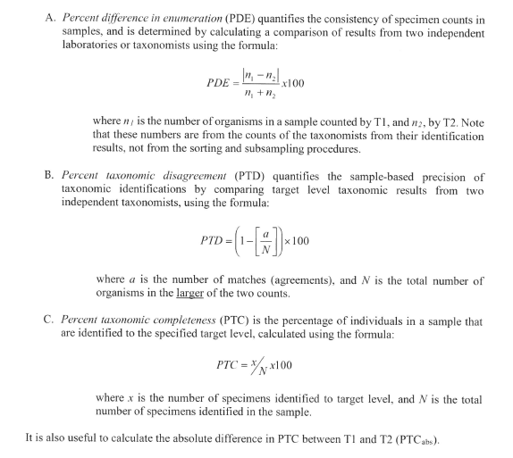

```{r setup, include=FALSE}
knitr::opts_chunk$set(echo = FALSE)
```

This tool is intended to pull benthic data and run QA metrics. After navigating to the `QA Tool` tab, users can upload a spreadsheet of stations for analysis on the left side of the page. The query will pull directly from CEDS based on stations and dates identified in the uploaded .csv spreadsheet. All data uploaded to the application must comply with the specified template. A sample template is available for download by clicking the `Download template.csv` button.

Once a .csv spreadsheet of stations and sample dates are uploaded to the application, the application will automatically begin to query CEDS for the associated benthic taxa and sample information. The `Data Retrieved` tab will display the spreadsheet uploaded to the application and any benthic data retrieved based on the uploaded station/date combinations. 

The `QA Metrics` tab overviews QA metrics run against all internal DEQ QA samples (BenSampID's beginning with QAQC) and EPA QA samples (BenSampID's beginning with EPAQAQC). The following metrics are run by the tool:




PTC_QA represents the Percent Taxonomic Completeness (PTC) score of the QA sample while PTC_O represents the PTC score of the original sample. PTCabs is the absolute difference between these two PTC scores. (SFSTCP reference Year)

The `QA Results` tab allows users to compare QA results for each station identified by the drop down select box. Once a station is selected, the `DEQ Taxa Comparison` table lines up the DEQ internal QA sample and original sample and calculates agreements, differences, and PTC scores. If EPA QA data is available for a selected station, the `EPA Taxa Comparison` table will appear with the same information listed above run against the EPA QA sample and original DEQ sample.

The `Download Results` tab allows users to download MS Excel workbooks of DEQ QA and EPA QA results and metrics.

#### References

Society for Freshwater Science Taxonomic Certification Program. Year???. *Quality Control Procedure for Sample-Based Taxonomic Data*. URL???